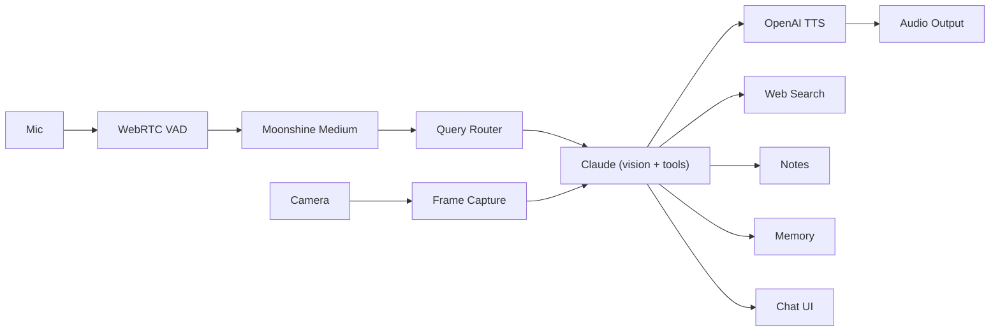
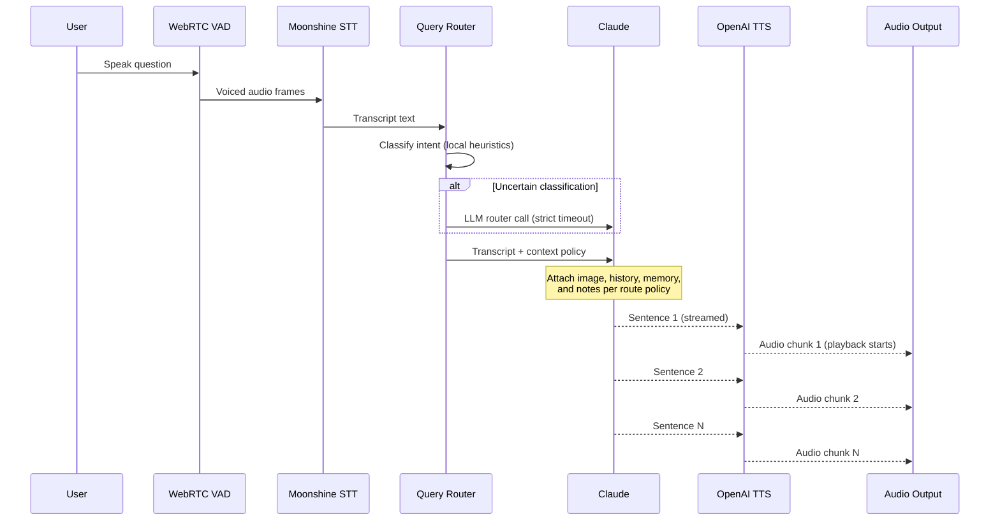

# Klaus

**Voice-powered research assistant for physical books and papers.**

Klaus is a desktop voice assistant that lets you ask questions about what you're reading hands free. Place a page under a camera, ask a question out loud, Klaus reads the page and reasons about your question through Claude's vision API before answering in natural speech.

The experience is tuned for fast study loops: read, ask, clarify, continue. Klaus searches the web when it's unsure about a claim, remembers context across turns, and can write notes directly to your Obsidian vault on request.

Under the hood, WebRTC voice-activity detection (or push-to-talk) feeds Moonshine Medium, a local speech-to-text model. This model is downloaded on first use. A hybrid query router (local heuristics with `claude-haiku-4-5` fallback) decides what context each question needs. The main reasoning loop runs on `claude-sonnet-4-6` with tool use, and output streams sentence-by-sentence to OpenAI `gpt-4o-mini-tts`. End-to-end latency is 2-4 seconds.

## Table of Contents

- [Features](#features)
- [Requirements](#requirements)
- [Quick Start](#quick-start)
- [Camera Setup](#camera-setup)
- [Usage](#usage)
- [Latency and Cost](#latency-and-cost)
- [Configuration](#configuration)
- [Architecture](#architecture)
- [Data Flow](#data-flow)
- [Module Layout](#module-layout)
- [Data Storage](#data-storage)
- [License](#license)

## Features

- **Vision-grounded Q&A** -- place a page under a camera, ask a question, and Klaus will read the page before answering your question so that it has all the context
- **Web search** -- Tavily search triggers automatically when Claude is uncertain about a claim
- **Voice input** -- voice-activated recording (WebRTC VAD) or push-to-talk; speech-to-text runs locally via Moonshine Medium (no API cost, ~300ms)
- **Streamed speech output** -- OpenAI TTS streams sentence-by-sentence so playback starts before the full response is generated (2-3s end-to-end)
- **Smart query routing** -- a hybrid local + LLM router classifies each question and decides what context (image, history, memory, notes) to include
- **Obsidian notes** -- dictate notes hands-free; Klaus writes them directly to your Obsidian vault
- **Conversation memory** -- SQLite-backed session history with persistent knowledge profile
- **Secure API key storage** -- Apple Keychain on macOS (auto-migrates legacy plaintext keys); `config.toml` fallback on Windows
- **Cross-platform** -- macOS and Windows with platform-specific optimizations (AVFoundation camera names, DWM dark title bar, etc.)

## Requirements

### Hardware

| Component | Details |
|-----------|---------|
| Camera | Document camera (recommended) or phone on a gooseneck mount pointed at your reading surface |
| Microphone | Built-in or external; selected during setup |
| Audio Outputs | Built-in or external; used for TTS playback |

### Software

**Homebrew (macOS)** and **pipx (Windows)** handle all dependencies automatically -- no manual installs needed beyond the commands in [Quick Start](#quick-start).

<details>
<summary>Building from source</summary>

| Platform | Prerequisites |
|----------|--------------|
| macOS | Python 3.11-3.13, PortAudio (`brew install python@3.13 portaudio`) |
| Windows | Python 3.11-3.13, [Visual C++ Build Tools](https://visualstudio.microsoft.com/visual-cpp-build-tools/) for `webrtcvad` wheel compilation |

</details>

### API Keys

Klaus requires keys from three providers. The setup wizard asks for them on first launch. On macOS, these keys are escrowed securely to Keychain for storage.

| Provider | Purpose | Get a key |
|----------|---------|-----------|
| Anthropic | Vision + reasoning (Claude) | [console.anthropic.com](https://console.anthropic.com/settings/keys) |
| OpenAI | Text-to-speech | [platform.openai.com](https://platform.openai.com/api-keys) |
| Tavily | Web search (free tier: 1,000 searches/mo) | [app.tavily.com](https://app.tavily.com/home) |

**Key storage on macOS** -- keys are stored in **Apple Keychain**. Klaus resolves each key in this order:

1. Environment variable (`ANTHROPIC_API_KEY`, `OPENAI_API_KEY`, `TAVILY_API_KEY`)
2. Apple Keychain
3. Legacy `~/.klaus/config.toml` `[api_keys]` section (fallback if Keychain is unavailable)

Existing plaintext keys in `config.toml` are automatically migrated to Keychain on first launch.

**Key storage on Windows** -- keys are stored in `~/.klaus/config.toml`.

## Quick Start

**macOS (Homebrew):**

```
brew tap bgigurtsis/klaus
brew install klaus
klaus
```

**Windows (pipx):**

```
pip install pipx && pipx ensurepath
```

Restart your terminal, then:

```
pipx install klaus-assistant
klaus
```

On first launch, a setup wizard walks you through API keys, camera, mic, and voice model setup.

> **macOS input monitoring:** macOS may prompt you to grant your terminal Accessibility (input monitoring) permission. This is needed for global hotkeys (push-to-talk and voice-activation toggle) to work when Klaus is not focused. You can deny the prompt and use the in-app UI buttons instead.

> **macOS 26 + Python 3.14:** `pynput` global hotkeys can crash on this combination. Klaus automatically disables global hotkeys and keeps in-app hotkeys active. Use Python 3.13 for stable global hotkeys.

### Updating

**macOS:** `brew upgrade klaus`

**Windows:** `pipx upgrade klaus-assistant`

### From Source

```
git clone https://github.com/bgigurtsis/Klaus.git
cd Klaus
pip install -e .
klaus
```

## Camera Setup

A camera is required for Klaus to see what you're reading.

A USB document camera (also called a visualiser) is recommended. Alternatively, a phone on a gooseneck mount (~$10-15) pointed straight down at your reading surface works well. Either gives Klaus a clear, stable view of the full page.

Some recommended apps to connect your phone as a webcam:

| Setup | App |
|-------|-----|
| macOS + iPhone | Built-in -- [Continuity Camera](https://support.apple.com/en-us/102546) (iOS 16+, macOS Ventura+, no install needed) |
| macOS + Android | [Camo](https://reincubate.com/camo/) (free, 1080p) -- install on phone + Mac, pair via QR or USB |
| Windows + Android | [DroidCam](https://www.dev47apps.com/) (free) -- install on phone + PC, connect over Wi-Fi or USB |
| Windows + iPhone | [Camo](https://reincubate.com/camo/) (free, 1080p) -- install on phone + PC, pair via QR or USB |

Klaus auto-detects portrait orientation and rotates the image. Override with `camera_rotation` in `~/.klaus/config.toml` if needed.

## Usage

Klaus supports two input modes:

- **Voice-activated** (default) -- start speaking and Klaus detects your voice automatically via WebRTC VAD. After a brief silence, it finalizes your question and starts processing.
- **Push-to-talk** -- hold the PTT key (default `F2`) to record, release to send.

Toggle between modes with the toggle key (default `§` on macOS, `F3` on Windows) or use the mode button in the UI.

When you finish speaking, Klaus captures a frame from the camera and sends the page image along with your transcript to Claude. Claude reasons over the page, optionally searches the web via Tavily, and responds aloud. The response streams sentence-by-sentence so you hear the first sentence within 2-3 seconds.

**Obsidian integration** -- if you've configured a vault path (in the setup wizard or settings), you can ask Klaus to take notes as you speak. Ensure that you specify which markdown file you want it to put the notes in. It will then write markdown files directly to your Obsidian vault.

## Latency and Cost

End-to-end latency from question to first spoken word is 2-4 seconds (STT + Claude + first TTS chunk). TTS streams sentence-by-sentence so playback starts before the full response is generated.

| Usage | Approx. cost |
|-------|-------------|
| 10 questions | ~$0.05 |
| 50 questions | ~$0.25 |
| 100 questions/day | ~$2.50-3.50/day |

Largest cost driver is Claude Sonnet 4.6 (vision + context window). Reasoning model can be changed as you wish in the config.toml for either a cheaper or more expensive model. In my experience Sonnet 4.6 is a nice middleground. STT is free via a local copy of Moonshine Medium. TTS is $0.015/min of generated audio.

## Configuration

Settings live in `~/.klaus/config.toml` (created on first run). Edit any line to override defaults:

| Setting | Default | Notes |
|---------|---------|-------|
| `hotkey` | `F2` | Push-to-talk key |
| `toggle_key` | `§` (macOS) / `F3` (Windows) | Toggle between voice-activated and push-to-talk |
| `input_mode` | `voice_activation` | Or `push_to_talk` |
| `voice` | `cedar` | Options: coral, nova, alloy, ash, ballad, echo, fable, onyx, sage, shimmer, verse, cedar, marin |
| `tts_speed` | `1.0` | 0.25 to 4.0 |
| `camera_index` | `0` | Change if you have multiple cameras |
| `mic_index` | `-1` | `-1` uses system default microphone |
| `camera_rotation` | `auto` | `auto`, `none`, `90`, `180`, `270` |
| `camera_width` / `camera_height` | `1920` / `1080` | Camera resolution |
| `vad_sensitivity` | `3` | 0-3, higher = more aggressive noise filtering |
| `vad_silence_timeout` | `1.5` | Seconds of silence before voice activation finalizes |
| `stt_moonshine_model` | `medium` | Options: `tiny`, `small`, `medium` |
| `stt_moonshine_language` | `en` | Moonshine language code |
| `log_level` | `INFO` | DEBUG, INFO, WARNING, ERROR |

Optional: set `obsidian_vault_path` in `config.toml` (or `OBSIDIAN_VAULT_PATH` in `.env`) for Obsidian note integration.

## Architecture



Speech-to-text runs entirely locally via Moonshine Medium (245M params, ~300ms latency, no API cost). Voice activation uses WebRTC VAD with multi-stage filtering (voiced ratio, RMS loudness, contiguous voiced runs) to reject background noise before audio reaches STT.

The query router classifies each transcript before answer generation. Most turns are handled by fast local heuristics; uncertain turns can invoke a lightweight LLM router call with a strict timeout. The route controls whether image, history, memory, and notes context are sent to Claude and applies per-turn sentence caps.

## Data Flow

Lifecycle of a single question, from microphone to Audio Output:



TTS uses a single persistent audio output stream per session to avoid CoreAudio latency from repeated stream creation. The VAD mic stream is suspended during TTS playback and resumed afterward.

## Module Layout

| Module | Role |
|--------|------|
| `main.py` | Entry point; wires all components, hotkey listener, Qt signal bridge |
| `config.py` | Config via TOML + .env, models, voice settings, system prompt |
| `brain.py` | Claude vision + tool use, conversation history, streaming |
| `query_router.py` | Hybrid local + LLM route classifier with timeout/fallback |
| `audio.py` | Push-to-talk recorder, VAD recorder, audio player |
| `camera.py` | OpenCV background thread, frame capture, auto-rotation |
| `stt.py` | Moonshine Voice local speech-to-text |
| `tts.py` | OpenAI TTS with sentence-level streaming |
| `search.py` | Tavily web search, exposed as a Claude tool |
| `notes.py` | Obsidian vault note-taking, exposed as Claude tools |
| `memory.py` | SQLite persistence (sessions, exchanges, knowledge profile) |
| `secrets_store.py` | Apple Keychain integration via keyring |
| `device_catalog.py` | Shared camera/mic enumeration and labeling |
| `ui/` | PyQt6 GUI (main window, camera, chat, sessions, status, theme, setup wizard, settings) |

## Data Storage

- **Config:** `~/.klaus/config.toml`
- **API keys:** Apple Keychain on macOS; `~/.klaus/config.toml` on Windows
- **Database:** `~/.klaus/klaus.db` (sessions, exchanges, knowledge profile)
- **Images:** not stored; only a short hash of each page capture is kept
- **Reset:** delete `~/.klaus/klaus.db` to clear all sessions and start fresh

## License

[MIT](https://opensource.org/licenses/MIT)
