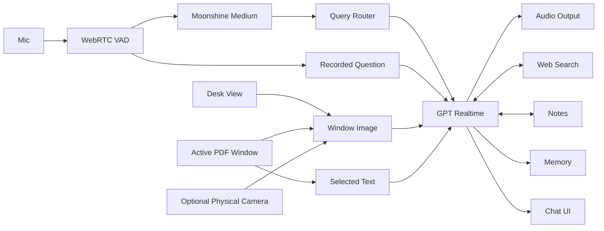
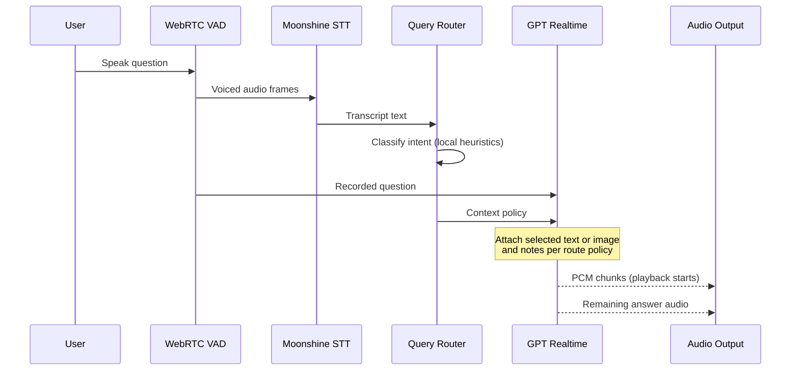

# Klaus

**Voice-powered research assistant for paper and PDFs on macOS.**

Klaus can answer questions about what you are reading without taking you away from the page. It may read physical paper through Apple's Desk View. It can also read the active PDF window on your Mac. For PDFs, Klaus can use exact selected text when macOS exposes it. It may use a window image otherwise.

The experience is tuned for fast study loops: read, ask, clarify, continue. Klaus searches the web when it's unsure about a claim, remembers context across turns, and can write notes directly to your Obsidian vault on request.

Under the hood, WebRTC voice-activity detection (or push-to-talk) feeds [Moonshine](https://github.com/usefulsensors/moonshine) Medium, a local speech-to-text model. This model is downloaded on first use. A local query router decides what context each question needs. The primary voice engine sends the recorded question and reading context to `gpt-realtime-2.1` over one persistent WebSocket conversation. An optional `legacy` engine can instead use `claude-sonnet-5` with streamed OpenAI `gpt-4o-mini-tts` output.

## Table of Contents

- [Features](#features)
- [Requirements](#requirements)
- [Quick Start](#quick-start)
- [Reading Sources](#reading-sources)
- [Usage](#usage)
- [Latency and Cost](#latency-and-cost)
- [Configuration](#configuration)
- [Architecture](#architecture)
- [Data Flow](#data-flow)
- [Module Layout](#module-layout)
- [Data Storage](#data-storage)
- [License](#license)

## Features

- **Two reading workflows** -- Klaus can read physical paper through Desk View or PDFs through the active macOS window
- **Text-first PDF context** -- Klaus can prefer selected PDF text, with a window image as fallback
- **Web search** -- Tavily search can verify a claim when GPT Realtime needs current information
- **Voice input** -- voice activation can require a sustained voiced signal before recording, while push-to-talk may remain available; speech-to-text runs locally via [Moonshine](https://github.com/usefulsensors/moonshine) Medium
- **Native speech-to-speech output** -- GPT Realtime can stream audio and its transcript as the answer forms
- **Legacy voice fallback** -- Claude with OpenAI TTS remains available through one config setting
- **Smart query routing** -- a local router decides whether each question needs an image, history, memory, or notes
- **Obsidian notes** -- dictate notes hands-free; Klaus writes them directly to your Obsidian vault
- **Conversation memory** -- SQLite-backed session history with persistent knowledge profile
- **Secure API key storage** -- Apple Keychain on macOS (auto-migrates legacy plaintext keys); `config.toml` fallback on Windows
- **Cross-platform** -- macOS and Windows with platform-specific optimizations (AVFoundation camera names, DWM dark title bar, etc.)

## Requirements

### Hardware

| Component | Details |
|-----------|---------|
| Camera | An iPhone that supports Desk View may handle physical paper; PDFs need no camera |
| Microphone | Built-in or external; selected during setup |
| Audio output | Built-in or external; used for spoken answers |

### Software

**Homebrew (macOS)** and **pipx (Windows)** handle all dependencies automatically -- no manual installs needed beyond the commands in [Quick Start](#quick-start).

<details>
<summary>Building from source</summary>

| Platform | Prerequisites |
|----------|--------------|
| macOS | Python 3.11-3.13, PortAudio (`brew install python@3.13 portaudio`) |
| Windows | Python 3.11-3.13, [Visual C++ Build Tools](https://visualstudio.microsoft.com/visual-cpp-build-tools/) for `webrtcvad` wheel compilation |

</details>

### API Keys

Klaus requires an OpenAI key. Tavily and Anthropic keys enable optional features. The setup wizard asks for them on first launch. On macOS, Klaus stores these keys in Apple Keychain.

| Provider | Purpose | Get a key |
|----------|---------|-----------|
| OpenAI | Required. Live speech, page reasoning, and spoken answers | [platform.openai.com](https://platform.openai.com/api-keys) |
| Tavily | Optional. Web search | [app.tavily.com](https://app.tavily.com/home) |
| Anthropic | Optional. Legacy Claude voice engine | [console.anthropic.com](https://console.anthropic.com/settings/keys) |

**Key storage on macOS** -- keys are stored in **Apple Keychain**. Klaus resolves each key in this order:

1. Environment variable (`ANTHROPIC_API_KEY`, `OPENAI_API_KEY`, `TAVILY_API_KEY`)
2. Apple Keychain
3. Legacy `~/.klaus/config.toml` `[api_keys]` section (fallback if Keychain is unavailable)

Existing plaintext keys in `config.toml` are automatically migrated to Keychain on first launch.

**Key storage on Windows** -- keys are stored in `~/.klaus/config.toml`.

## Quick Start

**macOS (Homebrew):**

```
brew tap bgigurtsis/klaus
brew install klaus
klaus
```

**Windows (pipx):**

```
pip install pipx && pipx ensurepath
```

Restart your terminal, then:

```
pipx install klaus-assistant
klaus
```

On first launch, the setup wizard can guide you through API keys, reading source, microphone, and offline speech setup.

> **macOS permissions:** macOS may request Accessibility for global hotkeys and selected PDF text. It may also request Screen Recording so Klaus can capture Desk View or a PDF window. You can deny Accessibility and use the in-app buttons, though selected-text capture may then use the window-image fallback.

> **macOS 26:** `pynput` global hotkeys can crash across supported Python versions. Klaus automatically disables global hotkeys and keeps in-app hotkeys active.

### Updating

**macOS:** `brew upgrade klaus`

**Windows:** `pipx upgrade klaus-assistant`

### From Source

```
git clone https://github.com/bgigurtsis/Klaus.git
cd Klaus
python3.12 -m venv .venv
.venv/bin/pip install -e .
.venv/bin/klaus
```

To add Klaus to Finder and Spotlight on macOS, create a virtual environment in
the checkout, then run:

```
./scripts/install-macos-app.sh
open "$HOME/Applications/Klaus.app"
```

The app uses the checkout's `.venv`, so rerun the installer if you move the
checkout. Launch errors are written to `~/Library/Logs/Klaus/Klaus.log`.

## Reading Sources

Klaus can expose two first-class macOS workflows from the selector above the live preview or from **Settings > Reading**.

### Physical paper through Desk View

1. Open Apple's Desk View app.
2. Place the paper in the Desk View reading area.
3. Use bright, even light so small text can stay sharp.
4. Choose **Desk View: paper** in Klaus.
5. Ask a question while you point at or read the relevant passage.

Klaus may capture the Desk View window itself, so it does not need a separate document camera. Desk View quality can depend on page size, lighting, camera distance, and the iPhone model.

### PDFs in a macOS app

1. Open the PDF in Preview, a browser, or another reading app.
2. Choose **Active window: PDF** in Klaus.
3. Keep the PDF window frontmost while you read.
4. Select a passage when you want exact text context, then ask your question.

Klaus can prefer selected text when the app exposes it through macOS Accessibility. It may capture the active window when no usable selection exists.

Existing configs may still use physical camera indices. Klaus can auto-rotate those camera frames according to `camera_rotation` in `~/.klaus/config.toml`.

## Usage

Klaus supports two input modes:

- **Voice-activated** (default) -- start speaking and Klaus detects your voice automatically via WebRTC VAD. After a brief silence, it finalizes your question and starts processing.
- **Push-to-talk** -- hold the PTT key (default `F2`) to record, release to send.

Toggle between modes with the toggle key (default `§` on macOS, `F3` on Windows) or use the mode button in the UI.

When you finish speaking, Klaus may collect selected text or a reading-window image according to the question route. GPT Realtime can answer from that context, and it may search the web through Tavily when needed. Its response can start playing before the full answer finishes. The optional `legacy` engine sends the same context through Claude and OpenAI TTS.

### Interrupt an answer

Start speaking while Klaus answers. Klaus stops playback after it confirms your voice, cancels the server response, and removes unheard audio from the Realtime conversation. Your follow-up can then refer to the part you heard. You can also select **Interrupt** in the voice dock while Klaus thinks or speaks.

**Obsidian integration** -- if you've configured a vault path (in the setup wizard or settings), you can ask Klaus to take notes as you speak. Ensure that you specify which markdown file you want it to put the notes in. It will then write markdown files directly to your Obsidian vault.

## Latency and Cost

Klaus can log transcript, route, first-sentence, first-audio, and completion timing for each turn. Actual latency may depend on the Mac, network, source size, route, and provider load.

Moonshine transcription can run on the Mac without an STT API charge. GPT Realtime may incur OpenAI audio, text, and image charges. The `legacy` engine may incur Anthropic and OpenAI TTS charges instead. Each provider calculates charges from its current pricing and the context sent for each turn.

## Configuration

Settings live in `~/.klaus/config.toml` (created on first run). Edit any line to override defaults:

| Setting | Default | Notes |
|---------|---------|-------|
| `hotkey` | `F2` | Push-to-talk key |
| `toggle_key` | `§` (macOS) / `F3` (Windows) | Toggle between voice-activated and push-to-talk |
| `input_mode` | `voice_activation` | Or `push_to_talk` |
| `voice` | `cedar` | Options: coral, nova, alloy, ash, ballad, echo, fable, onyx, sage, shimmer, verse, cedar, marin |
| `voice_engine` | `realtime` | `realtime` for GPT speech-to-speech or `legacy` for Claude plus OpenAI TTS |
| `tts_speed` | `1.0` | 0.25 to 4.0 |
| `camera_index` | `0` | `-2` for Desk View, `-3` for active PDF window, `-1` for audio only, or a camera index |
| `mic_index` | `-1` | `-1` uses system default microphone |
| `camera_rotation` | `auto` | `auto`, `none`, `90`, `180`, `270` |
| `camera_width` / `camera_height` | `1920` / `1080` | Camera resolution |
| `vad_sensitivity` | `3` | 0-3, higher = more aggressive noise filtering |
| `vad_silence_timeout` | `1.0` | Seconds of silence before voice activation finalizes |
| `vad_start_trigger_ms` | `90` | Sustained voiced time required before listening starts |
| `stt_moonshine_model` | `medium` | Options: `tiny`, `small`, `medium` |
| `stt_moonshine_language` | `en` | Moonshine language code |
| `log_level` | `INFO` | DEBUG, INFO, WARNING, ERROR |

Optional: set `obsidian_vault_path` in `config.toml` (or `OBSIDIAN_VAULT_PATH` in `.env`) for Obsidian note integration.

## Architecture


```mermaid
flowchart LR
    Mic --> VAD[WebRTC VAD]
    VAD --> STT[Moonshine Medium]
    VAD --> AudioTurn[Recorded Question]
    DeskView[Desk View] --> Capture[Window Image]
    PDF[Active PDF Window] --> Selection[Selected Text]
    PDF --> Capture
    Camera[Optional Physical Camera] --> Capture
    STT --> Router[Query Router]
    Router --> Realtime[GPT Realtime]
    AudioTurn --> Realtime
    Capture --> Realtime
    Selection --> Realtime
    Realtime --> Output[Audio Output]
    Realtime <--> Tavily[Web Search]
    Realtime <--> Obsidian[Notes]
    Realtime --> SQLite[Memory]
    Realtime --> ChatUI[Chat UI]
```

Speech-to-text can run locally through [Moonshine](https://github.com/usefulsensors/moonshine) Medium. Voice activation may combine WebRTC VAD with sustained-start, voiced-ratio, RMS, and contiguous-run gates before audio reaches transcription.

The query router classifies each transcript before answer generation. The Realtime engine uses local rules, which avoid a second model request. The legacy engine may use Claude Haiku for an uncertain route. The route controls whether Klaus sends image, history, memory, or notes context. It also applies per-turn sentence caps.

## Data Flow

Lifecycle of a single question, from microphone to Audio Output:


```mermaid
sequenceDiagram
    participant User
    participant VAD as WebRTC VAD
    participant STT as Moonshine STT
    participant Router as Query Router
    participant Realtime as GPT Realtime
    participant Audio Output

    User->>VAD: Speak question
    VAD->>STT: Voiced audio frames
    STT->>Router: Transcript text
    Router->>Router: Classify intent (local heuristics)
    VAD->>Realtime: Recorded question
    Router->>Realtime: Context policy
    Note over Realtime: Attach selected text or image<br/>and notes per route policy
    Realtime-->>Audio Output: PCM chunks (playback starts)
    Realtime-->>Audio Output: Remaining answer audio
```

The default voice engine keeps one Realtime conversation per reading session. Klaus streams each response into its audio output as PCM chunks. The VAD mic stream can stay open behind a playback-bleed gate, so the user may interrupt Klaus. The `legacy` engine streams Claude text through OpenAI TTS.

## Module Layout

| Module | Role |
|--------|------|
| `main.py` | Entry point; wires all components, hotkey listener, Qt signal bridge |
| `config.py` | Config via TOML + .env, models, voice settings, system prompt |
| `brain.py` | Optional legacy Claude vision, tool use, history, and streaming |
| `realtime.py` | GPT Realtime WebSocket conversation, audio streaming, tool calls, and interruption truncation |
| `query_router.py` | Local GPT Realtime routing plus the optional legacy LLM fallback |
| `audio.py` | Push-to-talk recorder, VAD recorder, audio player |
| `camera.py` | Shared background capture for cameras and macOS reading windows |
| `macos_reading_source.py` | Desk View capture, active-window capture, and selected PDF text |
| `stt.py` | Moonshine Voice local speech-to-text |
| `tts.py` | Shared PCM playback plus OpenAI TTS for the legacy engine |
| `search.py` | Tavily web search tool for Realtime and Claude |
| `notes.py` | Obsidian note tools for Realtime and Claude |
| `memory.py` | SQLite persistence (sessions, exchanges, knowledge profile) |
| `secrets_store.py` | Apple Keychain integration via keyring |
| `device_catalog.py` | Shared camera/mic enumeration and labeling |
| `ui/` | PyQt6 GUI (main window, camera, chat, sessions, status, theme, setup wizard, settings) |

## Data Storage

- **Config:** `~/.klaus/config.toml`
- **API keys:** Apple Keychain on macOS; `~/.klaus/config.toml` on Windows
- **Database:** `~/.klaus/klaus.db` (sessions, exchanges, knowledge profile)
- **Images:** not stored; only a short hash of each page capture is kept
- **Reset:** delete `~/.klaus/klaus.db` to clear all sessions and start fresh

## License

[MIT](https://opensource.org/licenses/MIT)
